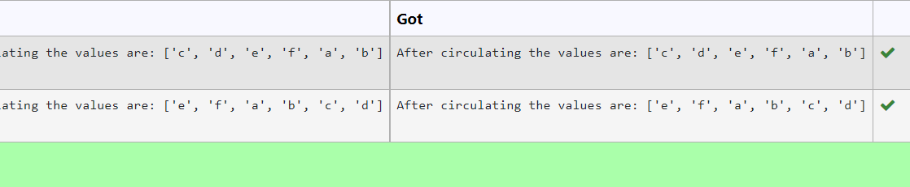

# Circulate-the-values-of-N-variables
## Aim:
To write a python program to circulate the n variables using function concept
## Equipment’s required:
PC
Anaconda - Python 3.7
## Algorithm: 
### Step 1: 
Create a function 
### Step 2: 
Get the input number from the user
### Step 3: 
Get the value from the user for the number of rotation
### Step 4: 
Using the slicing concept rotate the list

### Step 5:
Call the function   
## Program:
```
#Program to circulate N values.
#Developed by: 
#RegisterNumber:
def circulate():
    a=eval(input())
    x=int(input())
    print("After circulating the values are: {}".format(a[x:]+a[:x]))
```    
  

## Output:



## Result:

Thus , the circulation of n variables using function concept is successfully done.
